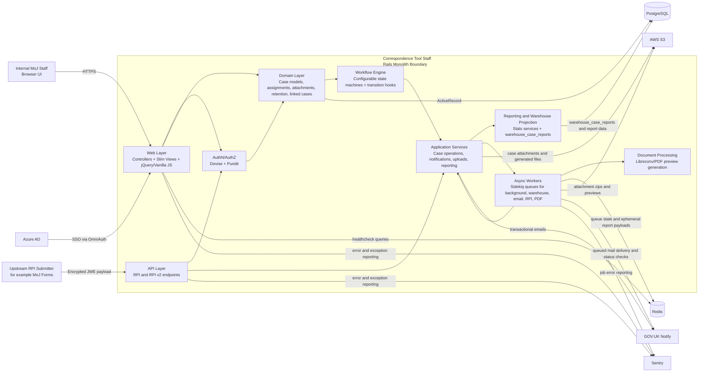
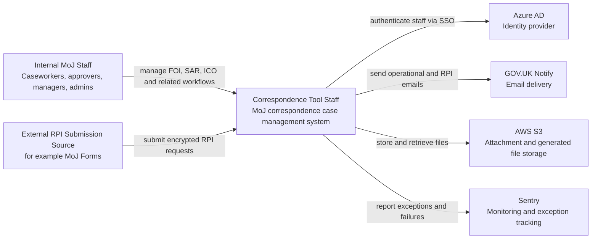
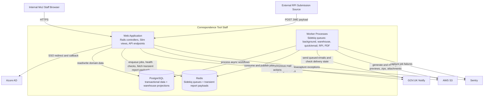
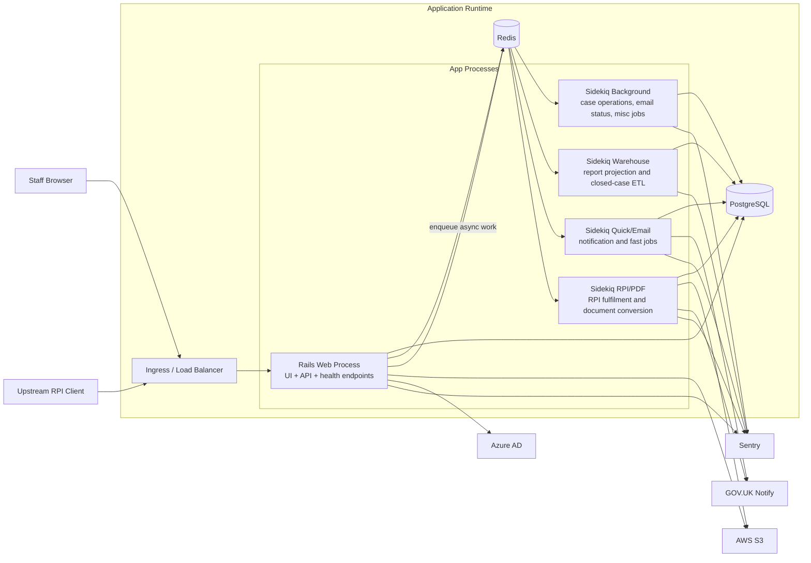
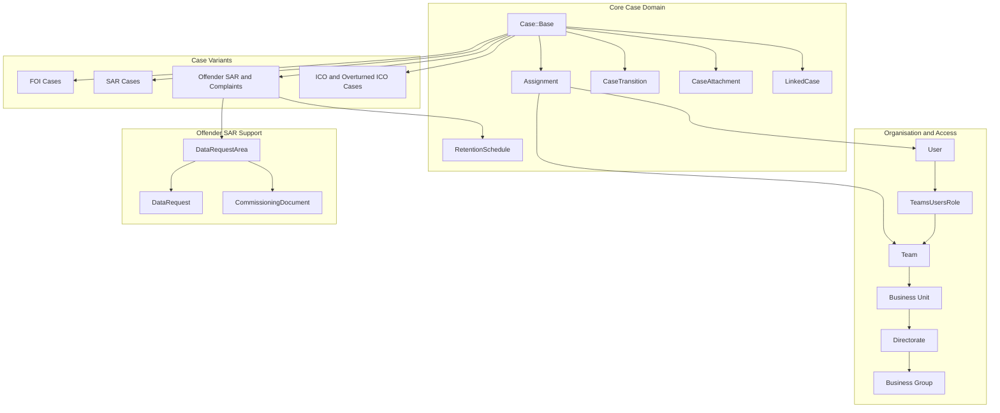
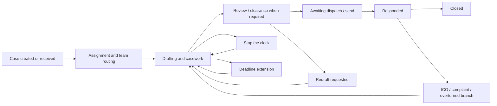

# High-Level System Architecture

This document describes the main runtime boundaries, supporting infrastructure, and external integrations for the Correspondence Tool Staff application.

## Overview

Correspondence Tool Staff is a Rails monolith used by MoJ staff to manage FOI, SAR, ICO, and related correspondence workflows. The application exposes two main entry points:

- an authenticated staff web UI for operational casework
- a small API surface for inbound Request Personal Information (RPI) submissions

The codebase is organised as a classic Rails monolith with domain models, service objects, Pundit policies, Draper decorators, state-machine driven workflows, and Sidekiq-backed asynchronous processing.

## System Diagram

## Runtime Shape

- Web process: Rails application serving the staff UI and API endpoints.
- Worker processes: Sidekiq queues are split by concern in development into background, warehouse, and quick/email workers.
- Data store: PostgreSQL holds both transactional case data and reporting projections such as `warehouse_case_reports`.
- Queue/cache store: Redis supports Sidekiq and is also used for temporary report payload storage.

## Internal Design Boundaries

- Presentation: Slim templates with jQuery and vanilla JavaScript for staff-facing workflows.
- Authentication: Devise with Azure Active Directory OmniAuth.
- Authorization: Pundit policies, rooted in case policies.
- Domain model: `Case::Base` with specialised subclasses for FOI, SAR, Offender SAR, ICO, and overturned ICO flows.
- Workflow control: state transitions are driven by configured state machines and transition hooks, rather than direct status mutation.
- Business logic: service objects handle case lifecycle actions, uploads, notifications, and reporting.
- Reporting: warehouse projection tables and stats services power monthly and closed-case reports.
- Asynchronous work: Sidekiq handles RPI processing, PDF preview generation, warehouse sync, email status, and performance report generation.

## Verified External Dependencies

- Azure AD: staff single sign-on.
- AWS S3: attachment storage, generated file storage, and download links.
- GOV.UK Notify: transactional and workflow-triggered email delivery.
- PostgreSQL: primary relational datastore.
- Redis: Sidekiq backing store and transient report payload storage.
- Sentry: exception and job failure monitoring.

## Notes

- The reporting "warehouse" is an internal reporting projection within the application and database, not a separate external analytics platform.
- The RPI API is a distinct system boundary: inbound encrypted payloads are accepted by the Rails app, expanded into internal request records, then fulfilled asynchronously via Sidekiq, S3, and GOV.UK Notify.
- The architecture is operationally split into processes, but remains a single deployable monolith rather than a microservice-based system.

## C4 Views

### System Context

This view shows Correspondence Tool Staff as a single product in relation to its users and external services.

### Container View

This view decomposes the monolith into deployable/runtime containers and supporting infrastructure.

## Deployment And Runtime View

This view focuses on process boundaries and the main operational execution paths. It is intentionally runtime-oriented rather than code-oriented.

Operational notes:

- The web tier remains the only HTTP entry point for both staff interactions and RPI API submissions.
- Sidekiq is logically split by queue responsibility, but all workers execute code from the same Rails monolith.
- Redis is both the Sidekiq transport and a transient store for some generated report payloads.
- PostgreSQL carries both operational case records and internal warehouse-style reporting projections.

## Domain And Workflow View

This view focuses on the main domain aggregates and the common case progression pattern used across FOI and SAR flows, with Offender SAR and ICO variants branching from the same core model.

Workflow notes:

- State transitions are configured through YAML-backed state machines and executed through services rather than directly from controllers.
- Transition hooks trigger secondary behaviour such as responder notifications, team notifications, reassignment mail, and approver review notifications.
- Offender SAR introduces additional data-request and commissioning-document flows, while ICO and complaint cases branch from or link back to an original case.
